# Healthy Hub

**Company Description:** Healthy Hub is a company specializing in the
development and provision of services in the field of a healthy lifestyle and
fitness. Their products and services are designed to improve users' physical
health, diet, and overall well-being.

**Potential Clients:**

1. **Individuals Pursuing a Healthy Lifestyle:** Healthy Hub attracts
   individuals who value their health and strive for an active and balanced
   lifestyle.

2. **Fitness Enthusiasts:** Athletes and fitness enthusiasts find valuable tools
   for tracking and improving their results through Healthy Hub.

3. **Those Aiming for Specific Goals:** Individuals aiming to achieve specific
   goals, such as weight gain or loss, improvement in physical fitness, etc.,
   find support and tools on the platform.

## Project Components:

## Backend Part:

1. Implemented user authentication systems, allowing users to log in to the
   system using unique accounts or register in the system. Users can also log
   out, invalidating their authentication token.

2. Developed functionality for user password recovery in case of forgetting
   their password. Users receive an email with a new password.

3. Prepared data for displaying statistical information related to the use of
   the service.

4. Displayed comprehensive user information and statistics on calorie
   consumption, water intake, and weight.

5. Added the ability to update user data in general and update their image,
   storing it on the cloudinary service.

6. Provided the ability to separately modify user goal data and weight.

7. Enabled adding and deleting food and water intake records.

8. Implemented a recommendation system that analyzes user information (daily
   goals) and provides personalized nutrition recommendations.

9. Launched the project on Swagger to facilitate collaboration and interaction
   between developers working on different parts of the system.

## Frontend Part:

### Header:

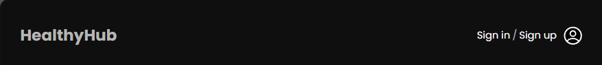

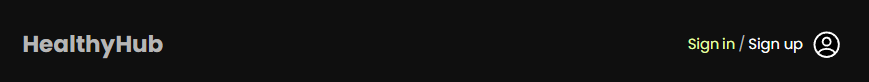

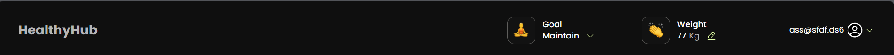

Depending on whether the user is authenticated or not, different information is
displayed. For unauthenticated users, the company logo and navigation for Sign
In/Sign Up are shown. When authenticated, the logo and user's weight, goal,
name, and avatar are displayed. Clicking on the logo redirects to the home page,
goal opens a modal for changing the user's goal, weight opens a modal for
changing weight, and clicking on the name reveals links to the settings page and
a Log Out button.

### Welcome Page:

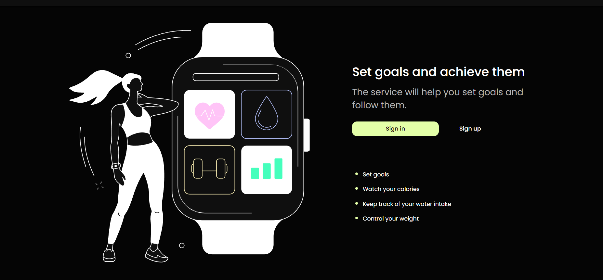

A page welcoming unauthenticated users, containing links to the Sign In and Sign
Up pages.

### Sign In Page:

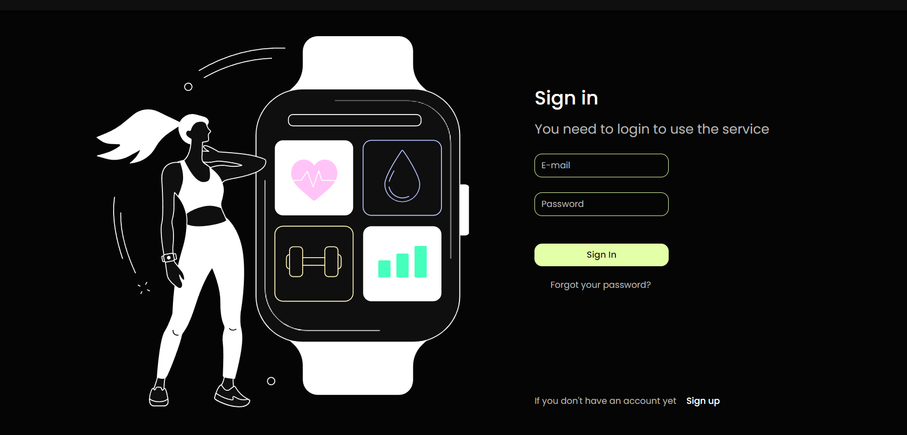

Includes a form with email and password fields for the authorization of
registered users.

### Forgot Password Page:

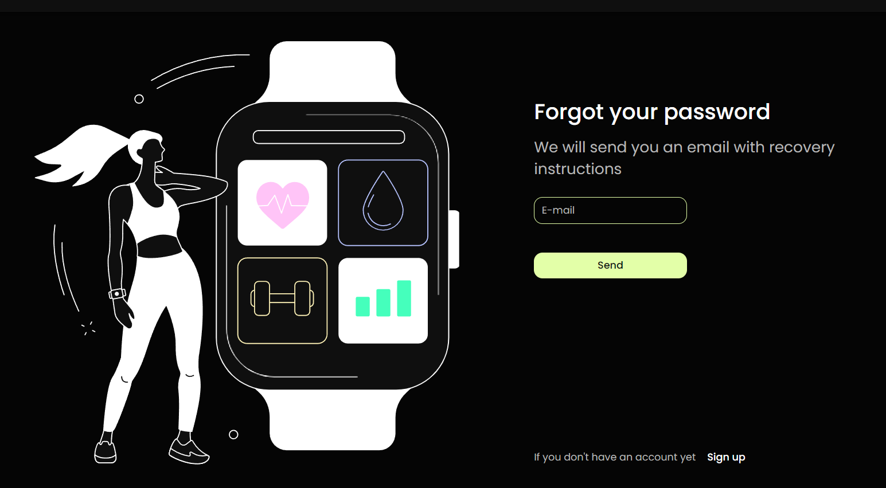

Allows users who have forgotten their password to recover it by entering their
email.

### Sign Up Page:

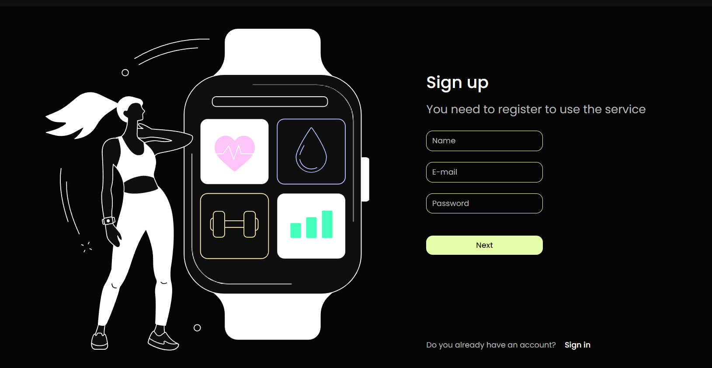

User registration page with a form for filling in user information, such as
name, email, and password.

### Your Goal Section:

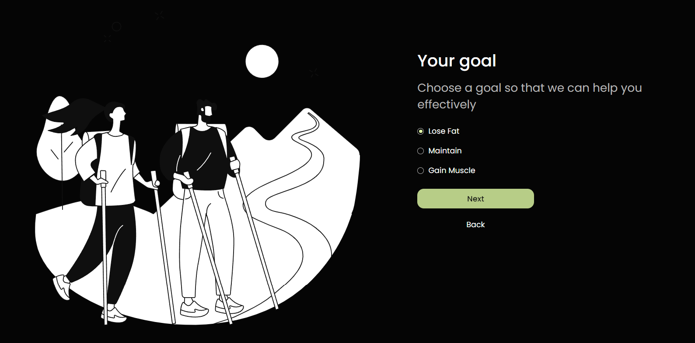

Continues the user registration process, filling in information about the user's
goal.

### Select Gender, Age Section:

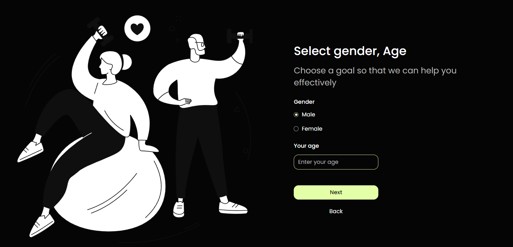

Continues the user registration process, allowing users to select gender and
age.

### Body Parameters Section:

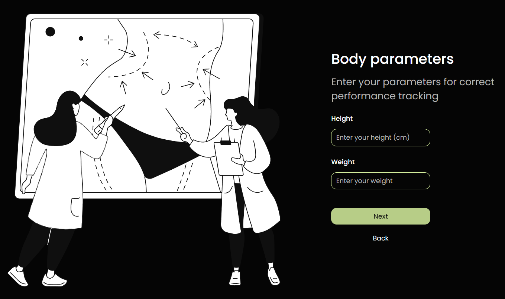

This section corresponds to the user's weight and height data.

### Your Activity Section:

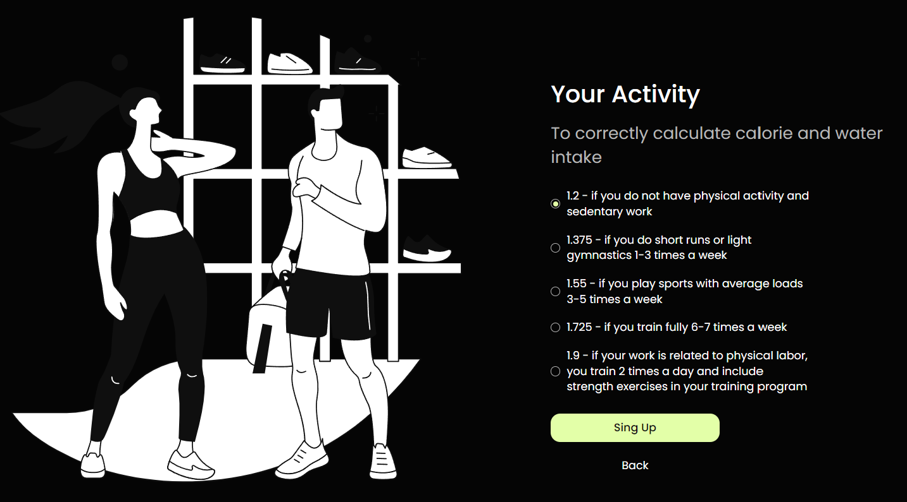

Handles user registration data related to physical activity. The Sign-Up button
registers the user and sends data to the backend.

### Main Page:

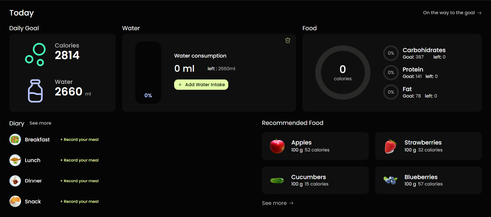

The main page for authenticated users contains essential user data and several
sections.

**Today Section:**

Displays the daily goals for water and calorie consumption. Users can input data
on water intake and see how much more they need to drink. The section also
includes information on calories and nutrients, with a graph of their
consumption. It has a link to the Dashboard page.

**Diary Section:**

Allows users to easily record their daily food intake, detailing the consumed
products. Users can track the content of carbohydrates, proteins, and fats for
each meal. There is also a link to the full list on the Diary page.

**Recommended Food Section:**

Shows a condensed list of recommended foods for the registered user. Clicking
"see more" takes the user to the Recommended Food page, displaying the full list
of recommended products.

### Dashboard:

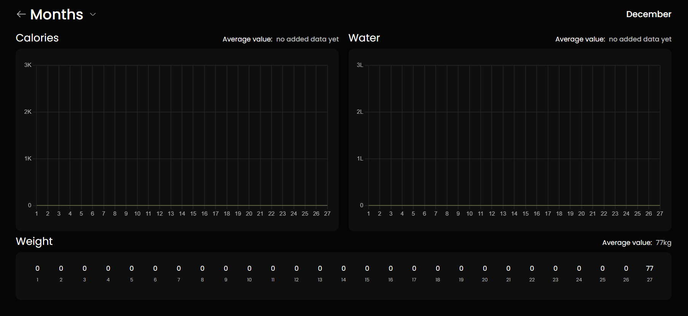

On this page, users can view their statistics for the current or past month,
including a graph of consumed calories, water intake, and a numerical graph of
their weight. This page is convenient for tracking progress in weight gain or
loss and monitoring water and calorie intake over the current or past month.

### Diary Page:

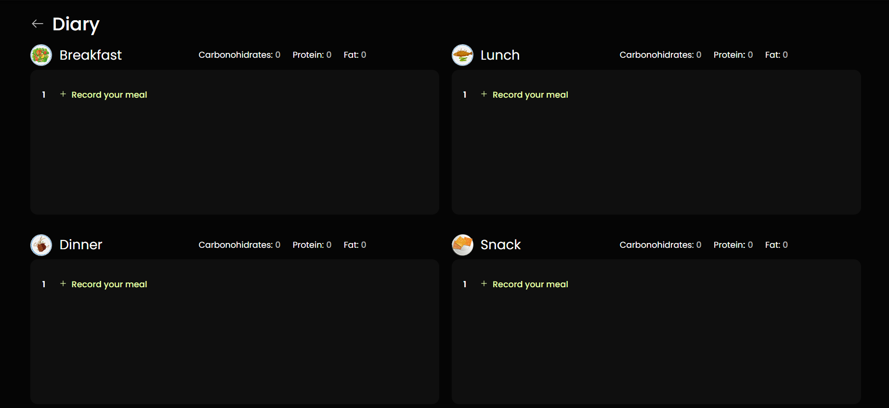

Provides information about food intake, detailing the meals consumed for
breakfast, lunch, dinner, and snacks. Users can add and modify meals, including
their calories and nutrients, and the system calculates the total for each meal.

### Recommended Food Page:

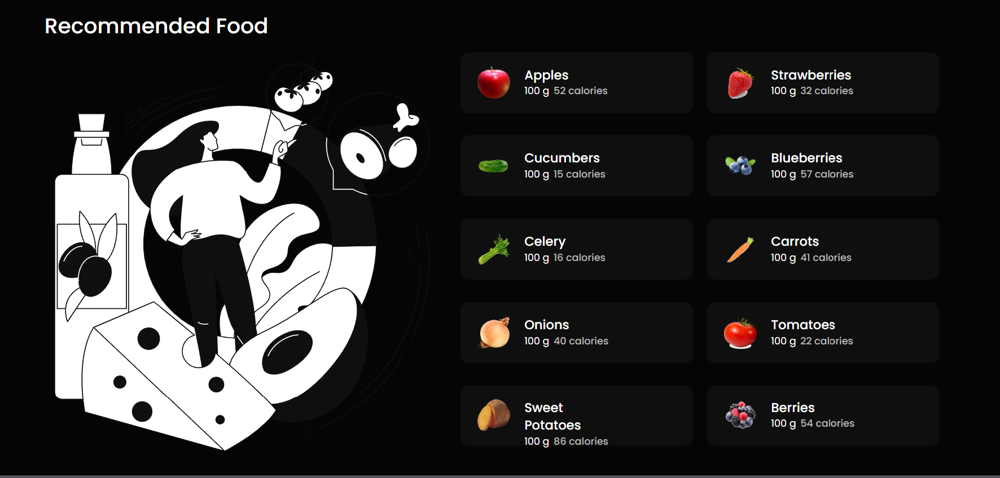

In this section, registered users can see products that are best for them based
on their personal needs, derived from their goals (e.g., weight loss or muscle
gain), weight, and diet. Each card displays the calorie count per 100 grams of
the product.

### Settings Page:

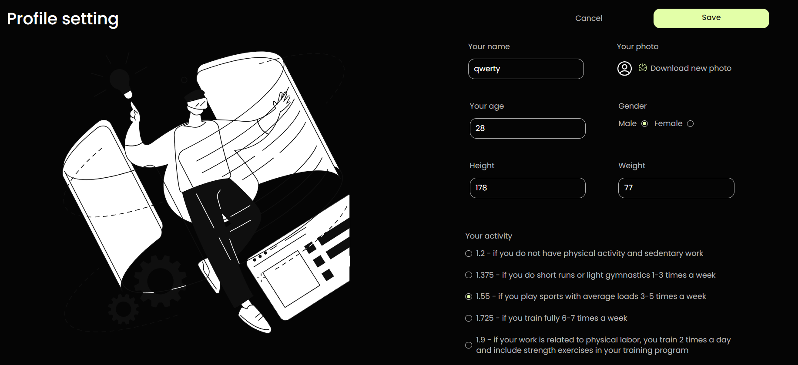

Displays comprehensive user information, such as name, age, gender, height,
weight, physical activity, and user avatar. Users can easily modify this data,
with numeric data validation to avoid errors. The chosen avatar is immediately
visible next to the user's photo, and changes are saved by clicking the "Save"
button, with the option to cancel changes.
